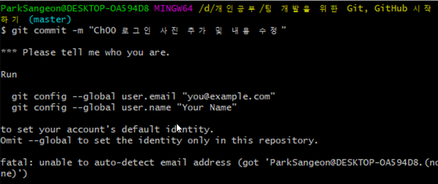

<div style="text-align:center">
<span style=";font-weight:bold;font-size:2em">팀 개발을 위한 Git,GitHub 시작하기</span>
</div>


# :zap: Chp00 - 빠른실습


## :page_with_curl: TODO LIST

| 구분 | 내용                                               |
| ---- | -------------------------------------------------- |
| 1절  | GitHub 가입하기 (생략)                             |
| 2절  | Git을 설치(생략)하고 로컬 저장소에서 커밋 관리하기 |
| 3절  | GitHub 원격저장소에 커밋 올리기                    |


고양이: 문어야 분담해서 개발한 소스코드를 어떻게 공유할까?

문어: 이메일? 근데 이건 너무 복잡할거 같아... 아! 최근에 Git이라는 것을 듣긴 했는데, 그걸 쓰는 건 어떨까?

고양이: 좋지! 내가 빠르게 알려줄테니 잘 따라오라구~


----


## :pencil2: Git, 그리고 GitHub


### 버전관리란?

내가 원하는 시점(Git에서는 버전)으로 이동할 수 있게 해주는 것이 **버전관리**이다.
그리고 이를 도와주는 툴이 **버전 관리 툴**이다 - 책에서


“버전 관리” 는 무엇이고 우리는 왜 이것을 알아야 할까? 버전 관리 시스템은 파일 변화를 시간에 따라 기록했다가 나중에 특정 시점의 버전을 다시 꺼내올 수 있는 시스템이다. - Git 공식 사이트


### Git, 그리고 GitHub

버전관리를 가능하게 해주는 시스템이 바로 Git

그리고 인터넷을 통해 Git으로 버전관리를 할 수 있게 해주는 Git호스팅 사이트가 바로 GitHub이다.


Git 호스팅 사이트는 사실 GitHub 외에도 GitLab,BitBucket 등이 있다.


## :pencil2: Git 로컬저장소에서 커밋 관리하기


### 로컬저장소 만들기

1\. `내 컴퓨터 > 바탕화면 >Programming > iTshirt-cat` 이라는 폴더를 생성


2\. \[iTshirt-cat] 폴더에서 텍스트 문서 생성후 아래와 같이 내용 작성


3\. \[iTshirt-cat] 폴더에서 마우스 오른쪽 클릭 후 \[Git Bash Here] 클릭


그러면 아래와 같은 검은창이 나온다.


4\. 검은창에  git init   +   \[Enter]


그러면 아래와 같은 화면이 보이고


폴더에 돌아가면  **\[.git]**  폴더가 생깁니다.

만약 보이지 않는다면 윈도우 디렉토리 창 상단의 \[보기] 탭을 누르고 \[ 파일 확장명 ] 에 체크를 해주세요.


이 폴더에는 Git으로 생성한 버전들의 정보와 원격저장소 주소 등이 들어있습니다.

이 폴더를 우리는 **로컬저장소**라고 부릅니다.


### 첫 번째 커밋 만들기

<span style="font-size:0.8em">Git에서는 생성되는 각각의 버전을 커밋이라고 합니다. 그러면 첫 커밋을 만들어보죠</span> 


1\. 버전관리를 위해 내 정보를 등록해야합니다. 각 버전을 누가 만들었는지 알아야 협업이 가능하니까요.

$ git config --global user.email "qkrtkddjs12345@gmail.com"   +   \[Enter]  

$ git config --global user.name "devtoroko"   +   \[Enter]


(만약 이 작업을 안하고 후에 쓰는 git commit 을 시도하면 아래와 같은 창이 나오면서 commit을 막게됩니다)




2\. 커밋에 추가할 파일을 선택합니다.

$ git add README.txt   +   \[Enter]


3\.  커밋에 상세 설명을 달아줍니다. 설명을 잘 적어 놓으면, 나중에 본인 및 타인에게 좋겠죠?

$ git commit -m "사이트 설명 추가"


드디어 첫 커밋을 해냈습니다.


4\. README.txt 파일의 내용을 변경해보죠. 끝에 "짱"을 붙여보고 저장하겠습니다.


5\. 다시 전에 했던 작업을 반복하여, 새로운 커밋을 만들어보죠.


6\. 여태 했던 작업을 쭉 살펴보죠

$ git log을 치면 다음과 같이 저희가 작업했던 내용이 보이네요.


### 다른 커밋으로 시간 여행하기

설명 업데이트 커밋에서 사이트 설명 추가 커밋으로 돌아가보죠


1\. `$ git log` 를 입력하여 **커밋 아이디**를 복사하고 다음과 

$ git checkout [커밋 아이디] 를 입력합니다.


\[ Head is now at ~~ ]이 보이면 성공입니다.


2\. README.txt 파일을 열어보면 "짱"이라는 글자가 없어진 것을 확인할 수 있습니다.

3\. 다시 체크아웃을 해서 최신 커밋으로 가고 싶으면

`$ git checkout -    `  라고 치면 됩니다.


## :pencil2: GitHub 원격저장소에 커밋 올리기

<span style="font-size:0.8em">원격저장소는 로컬저장소와 구분하는 개념이며,  GitHub에서는 원격저장소를 레포지토리라고 부릅니다.</span>


### 원격저장소 만들기


1\. GitHub에 접속후에 다음 과정을 따릅니다.


### 원격저장소에 커밋 올리기

<span style="font-size:0.8em">이제 이 원격저장소에 로컬저장소의 README.txt를 올려보죠.</span>


1\. 다시 Git Gash로 돌아와서 **remote add origin** 명령어를 통해서 **로컬 저장소에 원격저장소 주소를 알려줍니다**.

```spreadsheet
$ git remote add origin https://github.com/devToroko/iTshirt.git
```


2\. 이제 로컬저장소에 있는 커밋들을 push 명령어로 원격저장소에 올립니다.

```spreadsheet
$ git push origin master
```


---

<span style="color:red;font-weight:bold;font-size:1.5em">ERROR</span>


아앗.. 그런데 저는 이 책을 예전에도 해봐서 그런지 에러가 나네요! (에러 안나면 넘기세요 ^^)

예전에 git config --global user.name="~" 를 제가 바꾼 적이 있었나보네요... 아무튼 현재 github의 사용자 이름과 다른 이름을 써서 다음과 같은 에러가 납니다.


직역하면 devToroko/iTshirt.git은 NongSimNeoguri의 허용을 거부한다~ 라고 씌여있네요.
즉 현재 저의  user.name = NongSimNeoguri 인 상태여서 문제가 생긴겁니다.


이를 해결하기 위해서는 다음의 절차를 따라주세요.


1\. 윈도우 검색에서 "자격 증명 관리자"를 검색하세요


2\. 두개의 선택지가 있는데 "Windows 자격 증명"을 선택해주세요


3\. 그러면 아래에 뭔가 여러가지가 나옵니다.

그중에서 git:https://github.com 을 선택 후 편집을 진행합니다. 

(이미 고쳐서 아래와 같이 나오지 원래는 \[ 사용자 이름: NongSimNeoguri ] 였습니다.)


4\. 편집을 하고 저장을 하면 끝입니다!


---


다시 git push origin master 를 해보겠습니다.

아래와 같이 로그인 팝업창이 뜨면 로그인도 해주면 됩니다. 원격저장소 아이디(혹은 닉네임)와 동일해야 합니다.


3\. 원격 저장소에 제대로 반영되었는지 확인합니다.


## :pencil2: GitHub 원격저장소의 커밋을 로컬저장소에 내려받기


### 원격저장소의 커밋을 로컬저장소에 내려받기


1\. 아래 경로에 다음 폴더를 생성해줍니다.

```spreadsheet
C:\Users\parknote\Desktop\iTshirt-oct 
```

(제가 실수로 책이랑 경로가 약간 다르네요. 책에서는 내컴퓨터 \> 바탕화면 \> Programming \> iTShirt-oct 입니다)


2\. \[ iTshirt-oct ] 폴더에 마우스 우클릭 후 \[Git Bash Here] 를 해줍니다.


3\.  clone 명령어를 사용하면 내 컴퓨터의 롴ㄹ 저장소에 내려받을 수 있습니다. 아래 과정을 따라해보세요.


(참고로 Download Zip은 원격저장소와 버전 정보가 제외됩니다. 그러니 클론을 통해서 받아야합니다)


그 이후에 Git Bash에서 을 git clone 해줍니다. (맨끝에 `공백`과 `.` 을 넣어주세요)

```spreadsheet
$ git clone https://github.com/devToroko/iTshirt.git . 
```


4\. 이번에는 iTshirt-oct 에서 README.txt 파일을 열어서 수정, 저장, 커밋을 해보죠.


5\. 커밋 내용을 원격에 push도 해봅니다.


6\. 확인


### 원격저장소의 새로운 커밋을 로컬저장소에 갱신하기

<span style="font-size:0.8em">현재 oct 폴더는 원격과 커밋이 완전히 일치하지만 cat폴더는 그렇지 못하죠. iTshirt-cat 폴더로 이동해서 최신 커밋으로 갱신해줍시다.</span>


1\. pull 명령어를 통해서 원격저장소의 새로운 커밋을 내 로컬 저장소에 내려받아서 갱신해달라는 명령어입니다.

```spreadsheet
$ git pull origin master
```


## 복습


### 용어

Git : 버전관리 시스템입니다.

GitHub : Git으로 관리하는 프로젝트를 올려둘 수 있는 사이트

커밋 : 버전 관리를 통해 생성된 파일, 혹은 그 행위를 의미합니다.

체크아웃: 원하는 지점으로 파일을 되돌림

로컬저장소 : Git으로 버전 관리하는 내 컴퓨터 안의 폴더

원격저장소 : GitHub에서 협업하는 공간(폴더)

레포지토리 : (== 원격저장소)

푸시 : 로컬저장소의 커밋(버전 관리한 파일)을 원격저장소에 올리는 것

풀 : 원격저장소의 커밋을 로컬저장소에 내려받는 것


### 명령어

1. git으로 버전관리 시작
   ==> **git init** 
   
   
   


2. git으로 버전관리하기 ( 스테이지에 올리기 + 커밋하기 )
   ==> **git add README.txt**
   ==> **git commit -m "메시지"**


3. 커밋한 내용 확인하기
   ==> **git log**

   
   
4. 다른 커밋으로 이동하기
   ==> **git checkout [커밋 아이디]**  /  **git checkout -** (최신 커밋으로...)

   
   
5. 로컬저장소에 원격저장소 주소 저장하기

   ==> **git remote add origin [원격 주소]**

   
   
6. 원격저장소에 로컬저장소 내용 반영하기
   ==> **git push origin master**

   
   
7. 다른 로컬저장소에서 원격 저장소 내려받기
   ==> **git clone [원격 주소] .**  

   
   
8. 원격저장소의 새로운 커밋을 로컬저장소에 갱신
   ==> **git pull origin master**


## 참고


[Git]: https://git-scm.com/book/ko/v2/%EC%8B%9C%EC%9E%91%ED%95%98%EA%B8%B0-%EB%B2%84%EC%A0%84-%EA%B4%80%EB%A6%AC%EB%9E%80%3F	"Git"


