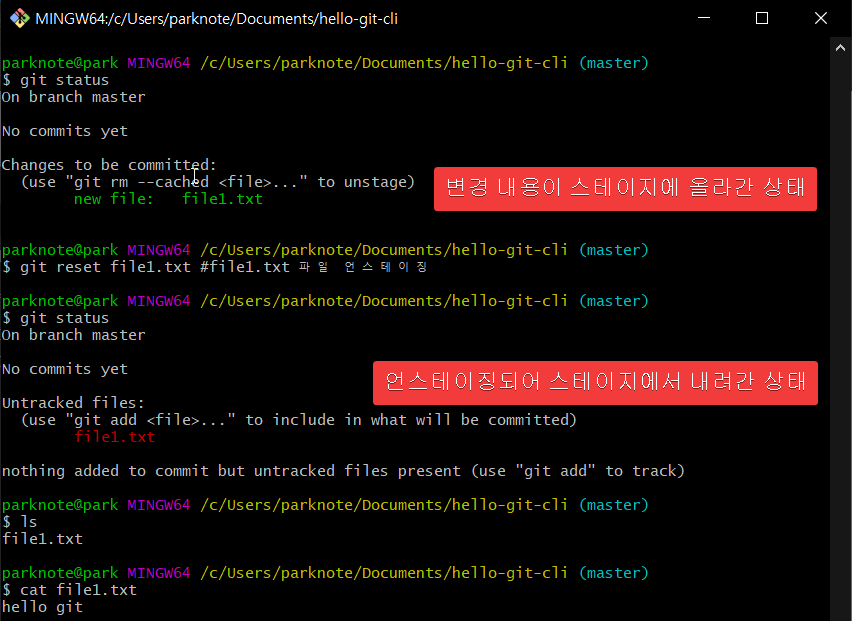

<div style="text-align:center">
<span style=";font-weight:bold;font-size:2em">팀 개발을 위한 Git, GitHub 시작하기</span>
</div>


여기서부터는 CLI를 배웁니다!


# :book: Ch06. Ch01~Ch05에서 사용한 기본 명령어


## :bow_and_arrow: ​TODO


| TODO LIST                                                    |
| ------------------------------------------------------------ |
| :dart: Git Hash                                              |
| :dart: 기본 명령어 사용하기(add, commit, reset, log, help)   |
| :dart: 원격저장소 관련 명령어 사용하기(remote, push, pull, clone) |


문어는 이제 제법 깃을 잘 사용하게되었습니다.

그런데 고양이는 계속 CLI 환경에서 Git을 사용하고 있네요.


---


## :cherry_blossom: Git Bash를 시작하자


### :seedling: 리눅스 기본 명령어

| 명령어              | 설명                                                         |
| :------------------ | ------------------------------------------------------------ |
| pwd                 | 현재 폴더의 위치를 확인합니다.                               |
| ls -a               | 현재 폴더의 파일 목록을 확인합니다.<br />-a 옵션을 이용해 숨김 파일도 볼 수 있습니다. |
| cd                  | 홈 폴더로 이동합니다.<br />홈 폴더는 사용자 이름과 폴더명이 같고 내 문서 폴더의 상위 폴더입니다. |
| cd <폴더이름>       | 특정 위치의 디렉토리로 이동합니다.                           |
| cd ../              | 현재 폴더의 상위 폴더로 이동합니다.                          |
| mkdir <새폴더 이름> | 현재 폴더의 아래에 새로운 폴더를 만듭니다.                   |
| echo "Hello Git"    | 메아리라는 뜻으로,  화면에 " " 안의 문장인 " Hello Git " 을 표시합니다. |

더 많은 것을 알고 싶으면 `리눅스 명령어`를 검색하세요


참고)

Git Bash를 치면 나오는 문구의 의미


- parknote : 사용자 아이디

- park : 현재 PC 이름

- '~'    : 현재 폴더 위치,   지금 여기 보이는 '~' 는 홈 폴더를 의미하며,
            홈 폴더의 전체 경로는 윈도우 10 기준으로  "C:\Users\사용자ID" 가 됩니다.


### :seedling: Git 로컬 저장소 생성하기


사용 경로:

/c/Users/parknote/Documents/hello-git-cli


```spreadsheet
$ git status
fatal: Not a git repository ( or any of the parent directories) : .git

====>
git status은 Git 저장소의 상태를 알려주는 명령으로 자주 사용합니다.
그런데 git status 명령어를 썼더니 위 처럼 에러가 나는군요.

이유는 .git  폴더가 없다는 이유입니다.(현재 디렉토리는 Git 저장소가 아니다)
즉 git status 명령은 Git 저장소에서만 (정확하게는 워킹트리)에서만 정상적으로 수행되는 명령입니다.
```


| 구분          | 설명                                                         |
| ------------- | ------------------------------------------------------------ |
| git status    | Git 워킹트리의 상태를 보는 명령으로, 매우 자주 사용<br />워킹트리가 아닌 폴더에서 실행하면 오류가 발생합니다. |
| git status -s | git status 명령 보다 짧게 요약해서 상태를 보여주는 명령으로, 변경된 파일이 많을 때 유용 |


<span style="font-weight:bold;color:red">Git 에서는 작업 폴더를 "워킹트리"라고 합니다</span>.


### :seedling: Git 헷갈리는 용어 정리


##### 워킹트리( working tree ) 

워크트리, 워킹 디렉토리, 작업 디렉토리, 작업 폴더 모두 같은 뜻으로 사용됩니다.

일반적으로 사용자가 파일과 하위 폴더를 만들고 작업 결과물을 저장하는 곳을 Git에서는 워킹트리라고 부릅니다.

공식문서에서는 워킹트리를 '**커밋을 체크아웃하면 생성되는 파일과 디렉토리**'로 정의하고 있습니다.

정확하게는 작업 폴더에서 \[.git] 폴더(로컬저장소)를 뺀 나머지 부분이 워킹트리입니다.


##### 로컬저장소 (local repository)

Git init 명령으로 생성되는 \[.git] 폴더가 로컬저장소입니다. 커밋, 커밋을 구성하는 객체, 스테이지가 모두 이 폴더에 저장됩니다.


##### 원격저장소 (remote repository)

로컬 저장소를 업로드하는 곳을 원격저장소라고 부릅니다. 우리가 사용하고 있는 GitHub 저장소가 원격저장소입니다.


##### Git 저장소

Git 명령으로 관리할 수 있는 폴더 전체를 일반적으로 Git 프로젝트 혹은 Git 저장소라고 부릅니다. 사실 이 말은 상당히 모호합니다만,   많은 분이 이렇게 생각하기 때문에 이 책에서도 처음 설명에 Git 저장소라는 단어를 사용했습니다. 일반적으로 Git 저장소를 작업 폴더와  혼동하기도 하고 워킹트리 + 로컬저장소의 느낌으로 사용하고 있는 듯 합니다만 공식문서에서는 로컬저장소와 Git 저장소를 같은 뜻으로 사용하고 있습니다. git init 명령을 수행할 때 나오는 메시지도 '비어있는 Git 저장소를 .git에 만듭니다' 라고 나온 것 기억하시죠?


---

요약:

- 워킹트리 : 일바적인 작업이 일어나는 곳
- 로컬저장소: .git 폴더, 커밋은 여기에 들어 있다.
- 작업 폴더 = 워킹트리 + 로컬저장소
- Git 저장소: 엄밀하게는 로컬저장소를 의미하지만 넓은 읨로 작업 폴더를 의미하기도 하니다.

---


### :seedling: 옵션 설정하기


Git 을 사용하기 위해서 해야 할 일이 더 있습니다. git config 명령을 사용해서 Git 옵션 설정을 해야합니다.

소스트리를 사용하면 소스트리가 알아서 해주니 편리하죠.


```spreadsheet
git config --global <옵션명>
지정한 전역 옵션의 내용을 살펴봅니다.

git config --global <옵션명> <새로운 값>
지정한 전역 옵션의 값을 새로 설정합니다.

git config --global --unset <옵션명>
지정한 전역 옵션을 삭제합니다.

git config --local <옵션명>
지정한 지역 옵션의 내용을 살펴봅니다.

git config --local <옵션명> <새로운 값>
지정한 지역 옵션의 값을 새로 설정합니다.

git config --local --unset <옵션명>
지정한 지역 옵션의 값을 삭제합니다.

git config --system <옵션명>
지정한 시스템 옵션의 내용을 살펴봅니다.

git config --system <옵션명> <새로운 값>
지정한 시스템 옵션의 값을 새로 설정합니다.

git config --system --unset <옵션명>
지정한 시스템 옵션의 값을 삭제합니다.

git config --list
현재 프로젝트의 모든 옵션을 살펴봅니다.
```


Git의 옵션에는 지역,  전역,  시스템 환경 옵션 세가지가 있습니다.


- 시스템 환경 옵션은 PC 전체의 사용자를 위한 옵션
- 전역 옵션은 현재 사용자를 위한 옵션
- 지역 옵션은 현재 Git 저장소에만 유효한 옵션


<span style="color:red;font-weight:bold">우선순위는 지역 \> 전역 \> 시스템</span> 옵션 순으로 가장 높습니다.

**일반적으로 개인 PC에서는 전역 옵션을 많이 사용하는데, 공용 PC 처럼 여러 사람이 사용하거나**

**Git을 잠깐만 써야할 일이 있다면 지역 옵션을 사용해야 합니다.**


시스템 옵션은 Git 이나 소스트리 설치 시에 몇 가지 값들이 지정되는데 직접 수정하는 일이 그리 많지 않습니다.


옵션 값을 이용해서 여러 가지 설정이 가능한데 지금은 필수적인 

1. user.name
2. user.email
3. core.editor

세 옵션의 값을 입력해 보겠습니다. 이미 소스트리를 사용했었기 때문에 값이 이미 있는 경우는 바꾸지 않습니다.

만약 값이 들어가있는지 확인을 하고 싶으면 어떡할까요?


"git config --global user.name " 이라고 git bash에 입력해서 아무런 결과가 출력되지 않으면 현재 값이 없다는 뜻입니다. 이때! 값을 설정하면 되는거죠~


아직 중요한 설정이 하나 더 남아 있습니다.

CLI를 사용하면 텍스트 에디터를 쓸 일이 생기는데, 현재 Git Bash의 기본 에디터는 보통 리눅스 운영체제에서 주로 쓰는 vim이나 nano로 설정되어 있습니다.

vim을 잘쓰면 괜찮지만, 잘 모르거나 애매하면 기본 에디터를 VS Code로 변경하는 게 좋습니다.


===> 결론: Git 재설치 하면 됩니다. 설치과정 중에 editor 설정하는 부분이 있는데, 거기서 선택하면 됩니다.


## :cherry_blossom: 기본 CLI 명령어 살펴보기


### :seedling: 스테이징과 커밋을 수행하는 add, commit


#### \- 명령어 개요

```spreadsheet
git add 파일1 파일2 ...
파일들을 스테이지에 추가합니다.
새로 생성한 파일을 스테이지에 추가하고 싶다면 반드시 add 명령을 사용합니다.


git commit 
스테이지에 있는 파일들을 커밋합니다.


git commit -a
add 명령을 생략하고 바로 커밋하고 싶을 때 사용합니다. 변경된 파일과 삭제된 파일은 자동으로 스테이징되고 커밋됩니다. 주의할 점은 untracked 파일은 커밋되지 않는다는 것입니다.


git push [-u] [원격저장소별명] [브랜치이름]
현재 브랜치에서 새로 생성한 커밋들을 원격저장소에 업로드합니다. -u 옵션으로 브랜치의 업스트림을 등록할 수 있습니다. 한 번 등록한 후에는 git push만 입력해도 됩니다.


git pull
원격저장소의 변경사항을 워킹트리에 반영합니다. 사실은 git fetch + git merge 명령입니다.


git fetch [원격저장소별명] [브랜치이름]
원격저장소의 브랜치와 커밋들을 로컬저장소와 동기화합니다. 옵션을 생략하면 원격저장소에 있는 모든 브랜치를 가져옵니다.


git merge 브랜치이름
지정한 브랜치의 커밋들을 현재 브랜치 및 워킹트리에 반영합니다.
```


#### \- 간단한 텍스트 파일 생성 및 확인


```spreadsheet
$ echo "hello git" > file1.txt  # 큰 따옴표 안의 텍스트로 file1.txt 파일 생성

$ ls

$ git status
```


생성한 파일 스테이지에 추가하기

```spreadsheet
$ git add file1.txt

$git status
```


### :seedling: reset 명령으로 스테이징 취소하기


위 그림을 보면 "git rm --cached \<file>..." 명령으로 스테이지에서 내릴 수 있다(unstage)는 메시지가 있습니다.

그런데 저 명령어보다  <span style="color:red;font-weight:bold">git reset</span> 명령어를 사용해서 더 쉽게 <span style="color:red;font-weight:bold">unstage</span> 를 할 수 있습니다.

```spreadsheet
git reset [파일명]

스테이지 영역에 있는 파일들을 스테이지에서 내립니다(unstage).
워킹트리의 내용은 변경되지 않습니다. 옵션을 생략할 경우 스테이지의 모든 변경사항을 초기화합니다.
```


리셋에는 3 가지 옵션인 soft, mixed, hard 를 사용할 수 있습니다.

 <span style="color:red;font-weight:bold">지금 처럼 옵션 없이 사용하면 mixed reset 으로 동작</span>합니다.




### :seedling: CLI로 첫 번째 커밋 생성


git commit 명령어를 쓰면 아래 그림과 같이 VS Code 에디터가 열리면서 커밋 메시지를 적을 수 있습니다

그런데 커밋 메시지 작성 시 주의할 점은 반드시 첫째 줄과 둘 째 줄 사이에 new line 이 있어야 한다는 점입니다.


그리고 **첫째줄은 커밋 메시지의 제목**,  **두번째로 오는 텍스트는 커밋 메시지의 본문** 같은 겁니다.

아참, 만약 commit 명령을 실행한 후 변심의 이유로 커밋이 하고 싶지 않으면, 
VS Code  에 아무 작업도 하지 않고  [ X ] 를 클릭해서 창을 닫으면 됩니다.


### :seedling: CLI 로 log 살펴보기


git log 명령으로 git의 커밋 히스토리를 확인해 봅니다.


맨 밑에 보이는  a472bc1 는 뭘까요? 

이 커밋 히스토리에 보이는 앞의 16진수 7자리 숫자는 <span style="color:red;font-weight:bold">커밋 체크섬</span> 혹은 <span style="color:red;font-weight:bold">커밋 아이디</span>입니다.
실제로는 40자리이지만, 화면에서는 7자리만 보이게 합니다.


참고)


==> 출처 : https://medium.com/@joongwon/git-git-%EC%9D%98-%EA%B8%B0%EC%B4%88-a7801f45091d


```spreadsheet
git log
현재 브랜치의 커밋 이력을 보는 명령입니다.

git log -n<숫자>
전체 커밋 중에서 최신 n개의 커밋만 살펴봅니다. 아래의 다양한 옵션과 조합해서 쓸 수 있습니다.

git log --oneline --graph --decorate --all
자주 사용하는 옵션으로 간결하고 멋지게 보여줍니다. 사실 소트리로 보는 것이 더 보 좋습니다.

--oneline : 커밋 메시지를 한 줄로 용약해서 보여줍니다. 생략하면 커밋 정보를 자세히 표시합니다.
--graph : 커밋 옆의 브랜치의 흐름을 그래프로 보여줍니다. GUI와 유사한 모습으로 나옵니다.
--decorate :  원래는 --decorate=short 옵션을 의미합니다. 브랜치와 태그 등의 참조를 간결히 표시.
--all : all 옵션이 없을 경우 HEAD와 관계없는 옵션은 보여주지 않습니다.

(외우기 힘들때는 "원기올때" 라고 외칩니다.)
```


---

Tip)  좋은 커밋 메시지의 7가지 규칙

1. 제목과 본문을 빈 줄로 분리한다.
2. 제목은 50자 이내로 쓴다.
3. 제목을 영어로 쓸 경우 첫 글자는 대문자로 쓴다.
4. 제목에는 마침표를 넣지 않는다..
5. 제목을 영어로 쓸 경우 동사원형(현재형)으로 시작한다.
6. 본문을 72자 단위로 줄바꿈한다.
7. 어떻게 보다 무엇과 왜를 설명한다.

---


### :seedling: 도움말 기능 사용하기


가끔 가다보면 모르는 명령과 옵션이 있을 수 있겠죠?

이럴때는 git help <명령어> 기능을 사용해보세요.


---


## :cherry_blossom: 원격저장소 관련 CLI 명령어


### :seedling: remote, push, pull

커밋을 모두 했으니 남은 작업은 원격저장소에 push를 보내는 것입니다.

일단 원격저장소를 먼저 만들어야겠죠?

아참!  사실 여태 말은 안했지만, 지금 같은 상황에서 원격저장소 생성시 주의할 게 있습니다.

그건 바로 원격 저장소 생성시 아래 그림의 아래쪽 빨간 박스처럼 옵션을 비워둬야 하는 것입니다.


만약 위처럼 옵션을 비우지 않으면, 원격저장소에 자동으로 커밋이 생성되고, 우리가 만든 로컬 저장소의 커밋과 충돌이 발생합니다. 

그리고 이런 충돌을 해결하기 위해서는 push --force 옵션을 사용해야 하는데, push --force 는 사실 좋지 않는 명령어입니다. 자제해야하는 명령어죠.


이제 원격 저장소를 등록하는 CLI 명령어를 살펴봅시다.


```spreadsheet
git remote add <원격저장소 이름> <원격저장소 주소>
원격저장소를 등록합니다.
원격저장소는 여러 개 등록할 수 있지만 같은 별명의 원격저장소는 하나만 가질 수 있습니다.
통상 첫 번째 원격저장소를 origin으로 지정합니다.


git remote -v
원격저장소 목록을 살펴봅니다.
```


앗, 에러가 뜨네요.  에러 메시지를 읽어 보면 로컬저장소의  \[master] 브랜치와 연결된 원격저장소의 브랜치가 없어서 발생한 오류라는 걸 알 수 있습니다.

그리고 업스트림(upstream) 이라는 텍스트가 보이는데, 
<span style="color:red;font-weight:bold">업스트림 브랜치는 로컬저장소와 연결된 원격저장소를 일컫는 단어</span>입니다.


에러 메시지가 알려주는 대로  `--set-upstream` 을 쓰거나 , 이 명령의 단축 명령인 `-u` 옵션을 사용합니다.

그러면 이후에는 origin 저장소의 [master] 브랜치가 로컬저장소의 [master] 브랜치의 업스트림으로 지정되어
`git push` 명령어만으로도 에러 없이 push가 가능해집니다.


갑자기 왜 그러는지는 모르겠지만 책에서는 소스트리에 이 로컬 저장소를 불러오네요. 일단 책대로 해봅니다.


잘 완성된 것을 소스트리로도 확인이 가능하려는 걸 보여주고 싶었나 봅니다.


### :seedling: clone


클론을 해보겠습니다.


상위 폴더로 올라간 후에 clone을 시도했는데 실패했네요.

이러한 이유는 \[ 새로운 폴더명 ]  옵션을 주지 않았기 때문인데요, 이 옵션을 주지 않으면 git은 복제한 프로젝트 이름과 같은 폴더를 만들게 되는데, 이미 [hello-git-cli] 라는 폴더가 있기 때문에 실패하는 것입니다.


```spreadsheet
git clone <저장소주소> [새로운 폴더명]

저장소 주소에서 프로젝트를 복제해 옵니다. 이때 새로 생길 폴더명은 생략 가능하며 폴더명을 생략하면 프로젝트 이름과 같은 이름의 폴더가 새로 생성됩니다. 
저장소 주소는 꼭 원격일 필요가 없으며 로컬저장소도 git clone 명령으로 복제할 수 있습니다.
```


이번에는 [새로운 폴더명] 옵션을 주도록 하겠습니다.


이번에는 git clone 명령이 정상적으로 성공했네요.

이 저장소에서 다시 한번 커밋과 push를 실행해 봅시다.


다시 첫번째 로컬저장소로 가서 원격저장소의 최신 커밋으로 갱신해보죠.


끝!


