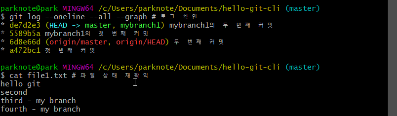
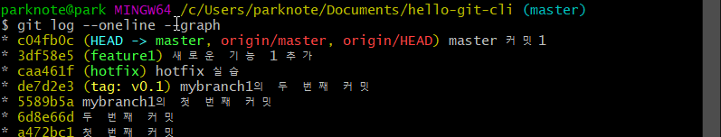

<div style="text-align:center">
<span style=";font-weight:bold;font-size:2em">팀 개발을 위한 Git,GitHub 시작하기</span>
</div>


# :anchor: Chp07 - 브랜치 생성 및 조작하기


##  :trident: TODO

| 구분 | 내용                                  |
| ---- | ------------------------------------- |
| 1절  | branch                                |
| 2절  | checkout,  merge,  reset --hard,  tag |
| 3절  | 3-way merge                           |
| 4절  | rebase                                |


 

## :ocean: CLI로 브랜치 생성하기


### :fish: branch 되돌아 보기


#### :sushi: 꼭 기억해야할 내용 2가지 


1. 커밋하면 커밋 객체가 생깁니다. 커밋 객체에는 부모 커밋에 대한 참조와 실제 커밋을 구성하는 파일 객체가 들어 있습니다.


2.  브랜치는 논리적으로는 어떤 커밋과 그 조상들을 묶어서 뜻하지만,  사실은 단순히 커미 객체 하나를 가리킬 뿐입니다. 


---

참고) 브랜치는 언제 사용하나요?

- 새로운 기능 추가
- 버그 수정
- 병합과 리베이스 테스트
- 이전 코드 개선
- 특정 커밋으로 돌아가고 싶을 때

---


### :fish: branch 생성하기


#### :sushi: ​명령어 개요

```spreadsheet
git branch [-v] 
=> 로컬 저장소의 브랜치 목록을 보는 명령으로 -v 옵션을 사용하면 마지막 커밋도 함께 표시됩니다.
표시된 브랜치 중에서 이름 왼쪽에 *가 붙어 있으면 HEAD 브랜치입니다.


git branch [-f] <브랜치 이름> [커밋체크섬] 
=> 새로운 브랜치를 생성합니다. 커밋 체크섬 값을 주지 않으면 HEAD로부터 브랜치를 생성합니다.
이미 있는 브랜치를 다른 커밋으로 옮기고 싶을 때는 -f 옵션을 줘야 합니다.


git branch -r[v]
=> 원격 저장소에 있는 브랜치를 보고 싶을 때 사용합니다. 마찬가지로 -v 옵션을 추가하여 커밋 요약도 볼 수 있습니다.


git checkout <브랜치 이름> 
=> 특정 브랜치로 체크아웃할 때 사용합니다. 브랜치 이름 대신 커밋 체크섬을 쓸 수 있습니다.
하지만 브랜치 이름을 쓰는 방법을 강력히 권장합니다.


git checkout -b <브랜치 이름> <커밋 체크섬> 
=> 특정 커밋에서 브랜치를 새로 생성하고 동시에 체크아웃까지 합니다. 두 명령을 하나로 합친 명령이기 때문에 간결해서 자주 사용합니다.


git merge <대상 브랜치>
=> 현재 브랜치와 대상 브랜치를 병합할 때 사용합니다. 병합 커밋(merge commit)이 새로 생기는 경우가 많습니다.


git rebase <대상 브랜치>
=> 내 브랜치의 커밋들을 대상 브랜치에 재배치시킵니다. 히스토리가 깔끔해져서 자주 사용하지만 조심해야 합니다. 이유는 추후에 설명합니다.


git branch -d <브랜치 이름>
=> 특정 브랜치를 삭제할 때 사용합니다. HEAD 브랜치나 병합이 되지 않은 브랜치는 삭제할 수 없습니다.


git branch -D <브랜치 이름>
=> 브랜칠르 강제로 삭제하는 명령입니다. -d 로 삭제할 수 없는 브랜치를 지우고 싶을 때 사용합니다.
역시 조심해야 합니다.
```


이제 본격적으로 실습을 시작할 것입니다.

실습 내용은 새로운 브랜치를 만들고 두 번 커밋을 한 후에 다시 마스터 브랜치로 병합합니다.
이 경우에는 마스터 브랜치로 빨리 감기 병합이 가능하므로 CLI로도 간단히 수행할 수 있습니다.


지난 Chp06에서 했던 hello-git-cli 로 돌아가서 실습을 계속해보겠습니다.

경로: `/c/Users/parknote/Documents/hello-git-cli`


#### :sushi:  실습


---

참고 1)   HEAD 에 대해 반드시 기억할 점

1. HEAD 는 현재 작업 중인 브랜치를 가리킵니다.
2. 브랜치는 커밋을 가리키므로 HEAD도 커밋을 가리킵니다.
3. 결국 HEAD 는 현재 작업 중인 브랜치의 최근 커밋을 가리킵니다.


참고 2) revert 를 사용해서 커밋을 되돌려야 하는 경우


C1 <- F1 <- C2 <- F2 <- C3 (master) 

하나의 기능 F 가 여러개의 커밋으로 나뉘어져 있으며 (F1, F2)
그 사이사이에 다른 커밋 C2, C3 가 있는 상황입니다.

이때 F라는 기능만 취소하고 싶은데 이런 때에는 revert 를 사용하면 됩니다.


git revert  F2

git revert F1


C1 <- F1 <- C2 <- F2 <- C3 <- RF2 <- RF1 (master) 

F2와 F1을 취소하는 커밋 RF2, RF1 을 각각 만들어냅니다. 이전의 히스토리를 변경하지 않고도 깔끔하게

히스토리 중간의 여러 커밋 내용을 작업 이전 상태로 되돌릴 수 잇으므로 현업에서 유용하게 사용됩니다.


만약 revert가 없었다면 어땠을까요?

새로운 브랜치를 만들고 한 땀, 한 땀 수동으로 변경사항을 직접 수정해서 master 브랜치에 병합하거나 ,

rebase -i 등을 이용해 필요한 커밋만 남기고 master 브랜치에 강제 푸시를 해야될 겁니다.

굉장히 찝찝하죠?

---


 

## :ocean: CLI 로 checkout 하기

체크아웃 명령은 브랜치의 내용을 워킹트리에 반영할 때 사용합니다. 정확하게 말하면 브랜치가 가르키고 있는 커밋의 내용을 워킹트리에 반영한다고 할 수 있습니다.


### :fish: CLI를 이용한 브랜치 체크아웃 및 새 커밋 생성

앞 절에서 만든 [mybranch1] 브랜치로 체크아웃을 하고, 새로운 커밋을 생성한 뒤에 결과를 확인해 봅니다.

<span style="color:red;font-weight:bold">HEAD가 현재 작업 중인 브랜치의 최근 커밋을 가리킨다</span>는 점을 꼭 기억하면서 실습에 임해주세요.


#### :sushi: 실습


#### :sushi: 참고) git checkout <커밋체크섬> 

잠깐! 

그런데 git checkout <커밋체크섬> 을 하면 어떤 일이 벌어질까요?

앞장에서 살짝 말했지만, HEAD와 브랜치가 분리되는 Detached HEAD 상황이 됩니다.
이 상황에서도 여전히 커밋을 생성할 수 있지만 <span style="color:red;font-weight:bold">다른 브랜치로 체크아웃 하는 순간 Detached HEAD의 커밋들은 다 사라져서 보이지 않게 됩니다</span>. 

사실 커밋은 여전히 로컬저장소에 남아 있기 때문에 이후에 설명할 git reflog 명령으로 복구할 수 있지만  <span style="color:red;font-weight:bold">권장하지 않는 방법</span>입니다. 


현재 커밋의 상황은 아래와 같습니다.


#### :sushi: 참고) 새로운 커밋을 생성하면...

1. 새로 커밋을 생성하면 그 커밋의 부모는 언제나 이전 HEAD  커밋입니다.
2. 커밋이 생성되면 HEAD는 새로운 커밋으로 갱신됩니다.
3. HEAD 가 가리키는 브랜치도 HEAD와 함께 새로운 커밋을 가리킵니다.


### :fish: CLI를 이용한 빨리 감기 병합


CLI 를 이용해서 병합을 해보겠습니다. 

실습 내용은 [mybranch1] 브랜치에서 추가로 한 번 더 커밋을 하고 [master] 브랜치로 체크아웃을 한 후 [master] 브랜치와  [mybranch1] 브랜치를 병합합니다.





이번 병합은 작업의 흐름이 하나였기 때문에 예상했던 빨리감기 병합으로 완료되었습니다.


### :fish: reset --hard 로 브랜치 되돌리기

reset 은 현재 브랜치를 특정 커밋으로 되돌릴 때 사용합니다. 이 중에서 많이 사용하는 <span style="color:red;font-weight:bold">git reset --hard</span> 명령을 실행하면 <span style="color:red;font-weight:bold">현재 브랜치를 지정한 커밋으로 옮긴 후 해당 커밋의 내용을 작업 폴더에도 반영합니다</span>.


```spreadsheet
git reset --hard <이동할 커밋 체크섬>
=> 현재 브랜치를 지정한 커밋으로 옮긴다. 작업 폴더의 내용도 변경된다.
```


위 명령어를 보면 알겠지만 git reset --hard 는 "커밋 체크섬"을 알아야 합니다.

git log 를 통해 확인할 수 있지만, CLI 에서 복잡한 커밋 체크섬을 타이핑하는 건 꽤 번거로운 작업입니다.

이럴 때는 보통 HEAD~  또는  HEAD^  로 시작하는 약칭을 사용할 수 있습니다.


```spreadsheet
HEAD~<숫자>
=> HEAD~은 헤드의 부모 커밋, HEAD~2는 헤드의 할아버지 커밋을 말한다.
HEAD~n 은 n번째 위쪽 조상이라는 뜻이다.


HEAD^<숫자>
=> HEAD^은 똑같이 부모 커밋이다. 반명 HEAD^2 는 두번째 부모를 가르킨다. 병합 커밋처럼 부모가 둘 이상인 커밋에서만 의미가 있다.
```


이번 절에서는 master 를 두 커밋 이전 커밋으로 옮겨보겠습니다.


잠깐!!!

reset --hard 와 checkout이 비슷한 느낌이 들지 않나요?

만약 `git checkout HEAD~2` 라고 입력하면 어떻게 될까요? 

이경우에는 [master] 브랜치는 그 자리에 있고, HEAD 만 옮겨 집니다. 소스트리에서 특정 커밋을 더블 클릭해서
체크아웃 한 것과 같은 detached HEAD 상황이죠. 

다시 [master] 브랜치와 HEAD를 연결하려면 어떻게 할까요? 아래 명령을 입력하면 됩니다!

$ git checkout HEAD~2

$ git branch -f master

$ git checkout master


위 3 개의 명령어를 한 번에 수행하는 게 reset --hard 입니다.

(뭔소린지 이해 못하겠음)


### :fish: 빨리 감기 병합 상황에서 rebase 해보기


git rebase <대상 브랜치> 명령은 현재 브랜치에만 있는 새로운 커밋을 대상 브랜치 위로 재배치시킵니다.

그런데 현재 브랜치에 재배치할 커밋이 없을 경우 rebase 는 아무런 동작을 하지 않습니다. 또한 빨리 감기 병합이 가능한 경우에는 rebase 명령을 수해앟면 빨리 감기 병합을 합니다.


### :fish: 배포 버전에 태깅하기


CLI로 태깅을 해보겠습니다. 태그는 사실 주석 있는 태그와 간단한 태그의 두 종류가 있습니다.


```spreadsheet
git tag -a -m <간단한 메시지> <태그 이름> [브랜치 또는 체크섬]
=> -a 로 주석 있는(annotated) 태그를 생성합니다. 
메시지와 태그 이름은 필수이며 브랜치 이름을 생략하면 HEAD에 태그를 생성합니다.


git push <원격저장소 별명> <태그 이름>
=> 원격 저장소에 태그를 업로드합니다.
```


---


 

## :ocean: CLI 로 3-way 병합하기

긴급한 버그 처리는 모든 개발자가 항상 겪는 일입니다. 버그가 생기지 않는 코딩 같은 건 존재하지 않기 때문이죠.
이번 절에서는 두 번째 시나리오인 "긴급한 버그 처리" 시나리오와 함께 3-way 병합에 대해 살펴봅니다.


### :fish: 긴급한 버그 처리 시나리오


갑작스레 버그를 발견한 상황을 생각해 봅시다. 보통 이 경우 하나 이상의 브랜치로 다른 기능 개선을 하고 있을 것입니다. 이런 상황에서 버그 수정은 다음과 같은 단계로 이루어집니다.


1. (옵션) 오류가 없는 버전(주로 Tag가 있는 커밋)으로 롤백 (체크아웃을 의미하는 것 같습니다)
2. [master] 브랜치로부터 [hotfix] 브랜치 생성
3. 빠르게 소스 코드 수정 / 테스트 완료
4. [master] 브랜치로 병합(Fast-forward) 및 배포
5. 개발 중인 브랜치에도 병합 (충돌 발생 가능성이 높음)


버그가 발생한 상황에서는 원래 작업 중이던 브랜치도 [master] 브랜치로부터 시작했기 때문에 같은 버그를 가지고 있을 것입니다. 때문에  [hotfix] 브랜치의 내용은 [master] 브랜치와 개발 브랜치 모두에 병합되어야 합니다. 

보통 [master] 브랜치의 병합은 빨리 감기이기 때문에 쉽게 되는 반면 개발 중인 브랜치의 병합은 병합 커밋이 생성되고, 충돌이 날 가능성이 아주 높습니다.


#### :sushi: 실습


이러한 상황을 가정하고 실습을 해 보겠습니다. 먼저 [feature1] 브랜치를 만들어 보죠.


이 시점에서 장애가 발생했다고 가정하겠습니다. 

그마나 다행인 점은 이미 커밋을 한 상태에서 장애가 발생했다는 점입니다. 현실에서는 커밋을 하기 모호한 상황에서 장애가 발생하게 됩니다. 이럴 때는 stash를 사용할 수 있지만, stash에 대해서는 뒷장에서 설명할 테니 일단
커밋을 한 직후에 장애가 발생했다고 가정하겠습니다.


이제 버그를 고치기 위해 [master] 브랜치에서 [hotfix] 브랜치를 만들어서 버그를 고친 후에 커밋을 합니다.

그 이후에는 [hotfix] 브랜치를 [master] 브랜치에 병합합니다.

[master] 브랜치의 치신 커밋을 기반으로 [hotfix] 브랜치 작업을 했기 때문에 빨리감기 병합이 가능한 상황입니다.


아직 추가 작업이 남아 있습니다. 물론 긴급한 작업은 끝났으니 한시름 놓은 상태이지만, hotfix 의 커밋은 버그 수정이었기 때문에 이 내용을 현재 개발 중인 [feature1] 브랜치에도 반영해야 합니다.


그런데 [feautre1] 브랜치와 [master] 브랜치는 아래 그래프에서 보듯이 서로 다른 분기로 진행되고 있습니다.

이 경우에는 빨리 감기 병합이 불가능하므로 3-way 병합을 해야 합니다.

당연하지만 병합 커밋이 생성되겠죠?


모든 3-way 병합이 충돌을 일으키는 것은 아닙니다만 이번 실습에서는 고의적으로 두 브랜치 모두 file1.txt 를
수정했기 때문에 충돌이 발생합니다.


일단 3-way 병합을 해보겠습니다.


==> git status 명령을 실행하여 충돌 대상 파일을 확인할 수 있습니다. 결과 메시지에서 볼 수 있는 것처럼
git merge --abort 명령을 통해 merge 를 취소할 수도 있습니다.


충돌이 난 해당 파일을 VS Code 로 열어서 확인하고 충돌을 해결해보죠.


병합 커밋이므로 커밋 메시지는 굳이 편집하지 않고 저장한 후에 에디터를 빠져 나오면 됩니다.

그러고 나면 병합이 완료되고 이제 버그 처리 작업도 끝난 것입니다.


 

## :ocean: CLI 로 rebase 해 보기

여러분은 GUI로 rebase를 얼마나 많이 사용해 봤나요? 입문자 분들은 아직까지 rebase가 익숙하지 않을 것이라고 생각됩니다. 이번 절에서는 잘 사용하면유용하고 강력한 기능인 rebase 를 CLI 로 사용해보겠습니다.


### :fish: rebase 사용하기

3-way 병합을 하면 병합 커밋이 생성되기 때문에 트리가 다소 지저분해진다는 단점이 있습니다.

이럴 때 트리를 깔끔하게 하고 싶다면 rebase 를 사용할 수 있습니다. rebase 는 소스트리 한글판에서 '재배치' 라고 표기되는데 상당히 좋은 번역입니다. 말 그대로 내 브랜치의 커밋들을 재배치하는 것이기 때문이죠.


#### :sushi: ​rebase  원리

1. HEAD 와 대상 브랜치의 공통 조상을 찾는다 (아래 그림의 C2) 
2. 공통 조상 이후에 생성한 커밋들(C4, C5 커밋)을 대상 브랜치 뒤로 재배치한다.


위 그림을 유심히 봅시다.

공통 분모를 찾고 대상 브랜치(master)의 최신 커밋 뒤로 붙는 걸 확인 할 수 있습니다.

그런데 이때 붙는 커밋들이 본래의 c4 와 c5 가 아닌 c4\` , c5\`  인 것을 확인할 수 있습니다.

즉 다른 커밋이라는 뜻입니다. 

rebase 명령어는 주로 로컬 브랜치를 깔끔하게 정리하고 싶을 때 사용합니다. 원격에 푸시한 브랜치를 rebase 할 때는 조심해야 합니다. 


#### :sushi: 실습하기


책에서는 제일 끝에 git push를 하지만 에러납니다. 아무래도 오타인거 같습니다.

아무튼 rebase 를 시도하지만 merge에서와 마찬가지로 충돌로 인해 rebase 는 실패합니다.

여기서 실패 메시지를 잘 보면 수동으로 충돌을 해결한 후에 스테이지에 추가를 할 것을 알려줍니다.

그리고 난 후 git rebase --continue 명령을 수행하라는 것도 알려줍니다.


어라. 책대로 VS CODE로 충돌을 수정했음에도 불구하고 맨 아래와 같은 문구가 나옵니다.
해석하면 "모든 머지 충돌을 수정한 후에 그들이 제대로 수정되었음을 git add로 표시해주세요"

아! 제가 책대로 안 한 게 있었군요. 저는 git add file1.txt를 안했었네요. 다시 작업해보겠습니다.


주의 : 
merge는 마지막 단계에서 git commit 을 하는 반면에, rebase  는 git rebase --continue 명령을 사용해야 합니다.

rebase 는 충돌이 여러번 나면 여러번 git rebase --continue 를 해야합니다. 그래서 merge로 해결하는 게 더 편할 수도 있습니다.


#### :sushi: 3-way merge  VS  rebase

|      | 3-way 병합             | rebase                                                   |
| ---- | ---------------------- | -------------------------------------------------------- |
| 특징 | 머지 커밋 생성         | 현재 커밋들을 수정하면서 <br />대상 브랜치 위로 재배치함 |
| 장점 | 한 번만 충돌 발생      | 깔끔한 히스토리                                          |
| 단점 | 트리가 약간 지저분해짐 | 여러 번 충돌이 발생할 수 있음.                           |


아래 그림을 보면서 다시한번 차이점을 확인해봅시다.


### :fish: 유용한 rebase의 사용법 : 뻗어나온 가지 없애기


Git 에 막 입문하면 master 브랜치를 하나만 써도 희한하게 브랜치가 여러개 생기는 경우가 있습니다.

이런 경우는 두 대의 PC에서 한 브랜치에 작업을 하는 경우에 생깁니다. 한 PC에서 커밋을 생성하고 push를
했는데, 다른 PC에서는 pull 을 하지 않고 커밋을 하게 되면 이전 커밋을 부모로 한 커밋이 생깁니다.

그 상황에서는 뒤늦게 pull을 하면 자동으로 3-way 병합되어 버립니다.


이런 경우에는 불필요한 병합 커밋이 생긴 상황입니다.

어떻게 하면 이걸 깔끔하게 정리할 수 있을까요?


답은 **reset --hard 로 병합 커밋을 되돌리고 rebase 를 사용하는 것**입니다. 간단하죠? 꼭 기억해둡시다.


#### :sushi: 일부러 쓸데없는 가지 만들기

먼저 가지 커밋을 하나 만들어 봅시다. 가지를 만들기 위해 정상인 커밋을 만들고 푸시합니다.





일단 평범하게 커밋을 하나 생성했습니다.  이제 로컬의 master 브랜치에서 reset --hard 를 이용해서 한 단계 이전 커밋으로 가서 다시 커밋을 생성하면 가지가 하나 생겨날 것입니다. 

origin/master 에 의한 가지와, 로컬에서 만든 또 다른 커밋에 의해서 2개의 가지가 생기게 되는 겁니다.


지금 같은 상황에서 git pull을 하면 어떻게 될까요? git pull = git fetch + git merge 이기 때문에 가지를 병합하기 위해서 병합 커밋이 생기고 괜히 커밋 히스토리가 지저분해집니다.


git pull 명령을 사용했더니 자동으로 병합 커밋이 생성된 것을 확인할 수 있습니다.


#### :sushi: 쓸데없는 가지 없애기


이제 쓸데없는 가지를 없애 볼까요?


git rebase origin/master 명령을 수행하면 [master] 브랜치의 가지 커밋이 [origin/master] 브랜치 위로 재배치된 것을 확인할 수 있습니다.


### :fish: rebase 주의사항

rebase 에는 중요한 주의사항이 있습니다. <span style="color:red;font-weight:bold">원격 저장소에 푸시한 브랜치는 rebase 하지 않는 것이 원칙</span>입니다.

예를 들어 C1 커밋을 원격에 푸시하고 rebase를 하게 되면 원격에는 C1이 존재하고, 로컬에는 다른 커밋인 C1\`가
생성됩니다. 이때 내가 아닌 다른 사용자가 C1을 병합할 수도 있습니다. 그런데 변경된 C1\` 도 언젠가는 원격에 푸시되고 그럼 원격에는 실상 같은 커밋이었던 C1과 C1\` 이 동시에 존재하게 됩니다. 이 상황에서 또 누군가는 충돌을 해결하기위해 merge나 rebase 를 사용하게 되는... 끔찍한 상황이 일어납니다.


그러니 rebase 는 git의 동작 원리를 잘 이해하기 전까지는 가급적 쓰지 마시길 바랍니다.


### :fish: 임시 브랜치 사용하기

많은 입문자가 충돌 해결, merge, rebase  등을 할 때 막연히 걱정부터 합니다. 소스가 깨지거나, 열심히 한 작업의 내용이 사라지는 두려움, 그리고 Git의 커밋 히스토리가 꼬일 것 같은 느낌이 동시에 들기 때문이죠.


이럴 때 걱정을 덜 수 있는 아주 쉬운 방법이 있습니다. 바로 임시 브랜치를 사용하는 것이죠.

원래 작업하려고 했던 브랜치의 커밋으로 임시 브랜치를 만들고 나면 해당 브랜치에서는 어떤 짓을 해도 상관없습니다. 나중에 그 브랜치를 삭제하기만 하면 모든 내용이 원상 복구됩니다.

임시 브랜치가 필요없는 시점에 CLI 에서 `git branch -D <브랜치 이름> ` 을 사용합니다.


commit, merge, rebase  등 다양한 작업을 미리 테스트해 보고 싶을 때 간단하게 임시 브랜치를 만들어서 사용하고, 불필요해지면 지금처럼 지우면 그만입니다.

