<div style="text-align:center">
<span style=";font-weight:bold;font-size:2em">팀 개발을 위한 Git,GitHub 시작하기</span>
</div>


# :anchor: Chp08 - Git 내부 동작 원리


##  :trident: TODO

| 순서 | 내용                 |
| ---- | -------------------- |
| 1절  | git add 동작 원리    |
| 2절  | git commit 동작 원리 |
| 3절  | 커밋 객체의 구성     |
| 4절  | 브랜치 이해하기      |


## :ocean: git add 동작 원리


### :fish: git init 다시 보기

Git Bash를 띄우고 [문서] 폴더로 이동합니다.
[문서] 폴더 안에 [git-test] 이름의 폴더를 만들고 git init 명령으로 로컬저장소를 하나 만듭니다.


#### :sushi: 저장소 생성

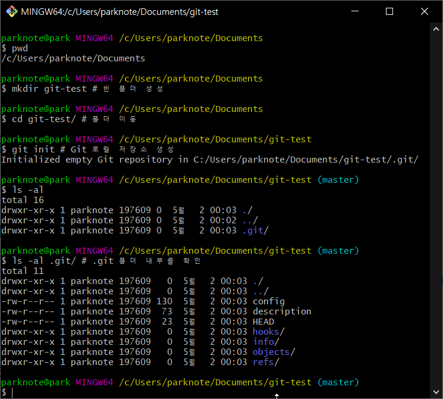


.git (로컬 저장소) 에 뭔가 많은 것들이 들어있네요. 지금부터 차근차근 알아 보죠.


#### :sushi: 참고) ls -al 명령에서 각 컬럼의 의미


```spreadsheet
-rw-r--r-- 1 parknote 197609  23  5월  2 00:03 HEAD
```

| 구분        | 내용                                                         |
| ----------- | ------------------------------------------------------------ |
| -rw-r--r--1 | 첫 번째 칸은 파일의 권한과 상태인데 우리에게는 크게 중요하지 않습니다.<br />'-' 로 시작하면 일반 파일, 'd'로 시작하면 폴더라는 것만 기억하면 됩니다. |
| parknote    | 파일 소유자 아이디                                           |
| 23          | 파일의 크기, 바이트로 표시, 폴더는 0으로 표시됩니다.         |
| 5월 2 00:03 | 파일 생성 시간                                               |
| HEAD        | 파일 이름, 폴더의 경우 / 가 붙습니다.                        |


### :fish: git add와 git status 다시 보기

먼저 실습에 사용할 명령을 살펴보겠습니다. 이 명령들은 저수준(low level) 명령어라고 하는데
실제로 많이 사용되는 명령은 아닙니다. 이번 실습에서만 동작 원리를 이해하기 위해서 사용하는 명령이라고 
생각하시면 됩니다.

| 명려어                   | 내용                                                         |
| ------------------------ | ------------------------------------------------------------ |
| git hash-object <파일명> | 일반 파일의 체크섬을 확인할 때 사용합니다.                   |
| git  show  <체크섬>      | 해당 체크섬을 가진 객체의 내용을 표시합니다.                 |
| git ls-files --stage     | 스테이지 파일의 내용을 표시합니다.<br />스테이지 파일은 git add 명령을 통해 생성되는데,<br />.git/index 파일이 스테이지 파일입니다. |


#### :sushi: 파일 생성 및 워킹트리 상태 확인

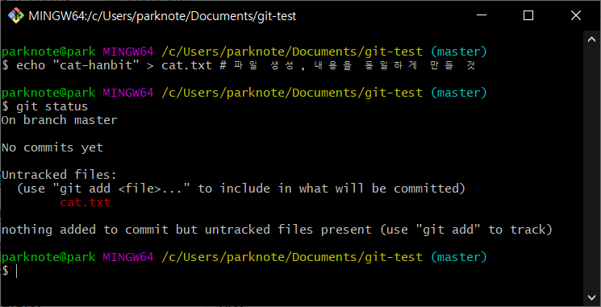


파일 생성 후 git status를 했을 때, 해당 파일이 Untracked 라는 것을 알 수 있습니다.

git status 명령은 워킹트리의 상태를 보는 명령이라는 것도 이미 알고 있지만 정확하게 어떤 일을 하는 걸까요?

<span style="color:red;font-weight:bold">git status</span> 명령은 <span style="color:red;font-weight:bold">워킹트리와 스테이지, 그리고 HEAD 커밋 세 가지 저장 공간의 차이를 비교</span>해서 보여줍니다.


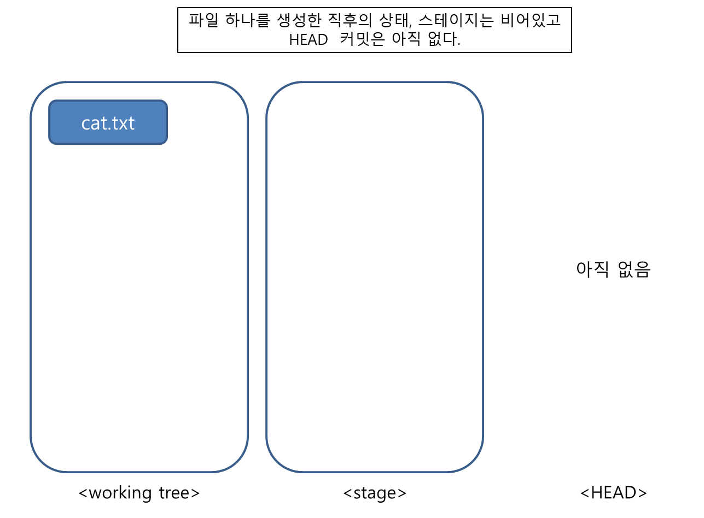

현재의 상태는 위 그림과 같습니다. 새로 파일을 생성할 경우 워킹트리에만 해당 파일이 존재합니다. 
스테이지는 아직 비어 있는 상태이고 한 번도 커밋을 하지 않은 상태이기 때문에 HEAD 커밋은 없습니다.

이제 파일을 커밋해 보려고 하는데 그 전에 <span style="color:red;font-weight:bold">파일의 체크섬</span>을 확인해 보겠습니다.


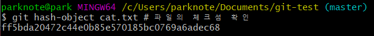

파일을 생성만 했는데도 체크섬이 생기는군요!


파일의 체크섬이 나오네요. 체크섬은 SHA1 에 의해서 생성된 긴~문자열인데, 파일의 체크섬이 만들어질 때는
파일의 내용을 통해서 SHA1 알고리즘을 사용합니다. 그렇기 때문에 같은 내용의 텍스트 파일이면 파일의 체크섬
은 완전히 동일합니다!

앞의 **ff5bda** 를 잘 기억해둡시다. 계속 쓸거 거든요.


#### :sushi: 스테이지에 파일 추가

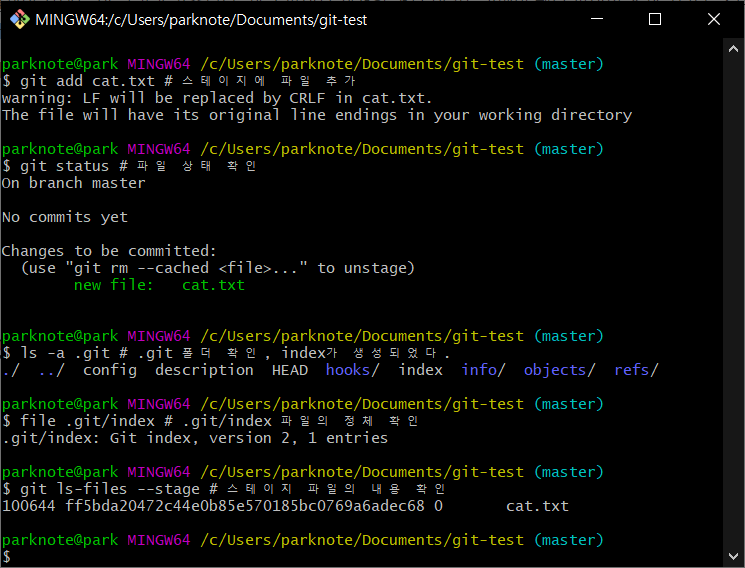


[.git] 폴더를 보면 index 라는 파일이 생긴 것을 알 수 있습니다.

file 명령을 이용해 .git/index 의 정체를 확인하면 Git index라는 것을 알 수 있습니다.

<span style="color:red;font-weight:bold">index 는 스테이지의 다른 이름입니다</span>. 

<span style="color:red;font-weight:bold">이 index 파일이 바로 Git의 스테이지입니다</span>.


스테이지의 내용을 확인하는 명령어 `git ls-files --stage` 를 사용하면, cat.txt 파일이 스테이지에 
들어있으며,  체크섬은 좀 전에 확인한 값과 정확하게 일치한다는 것을 알 수 있습니다.


이 상태에서 [.git] 폴더를 조금 더 살펴 봅시다.

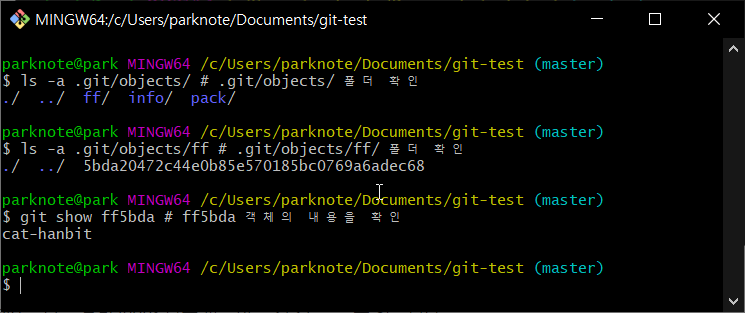


[.git/objects] 폴더 아래에   ff/  로 시작하는 폴더가 생긴 것을 알 수 있는네요.

[.git/objects/ff] 폴더 안에는 5bda로 시작하는 파일이 하나 있는데, 폴더명과 파일명을 합쳐보면 [ ff + 5bda ]
'ff5bda' 입니다.  정확하게 앞에서 확인했던 파일의 체크섬과 일치하는 값입니다.

<span style="color:red;font-weight:bold">[objects] 폴더 안에 존재하는 파일들은 Git객체</span>입니다.

git show ff5bda 명령으로 해당 객체의 내용을 확인하면 cat-hanbit 이라는 텍스트 파일이라는 것을 확인 할 수 있습니다.


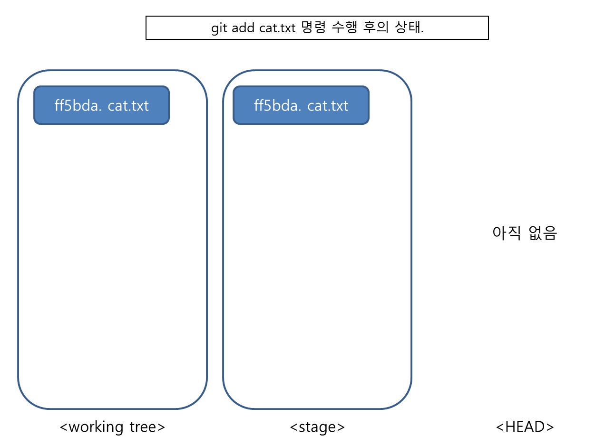


체크섬을 이용해서 객체의 종류와 내용을 확인할 수 있는 다른 명령도 있습니다


| 명령어                           | 내용                                                         |
| -------------------------------- | ------------------------------------------------------------ |
| git cat-file -t <체크섬>         | 해당 체크섬을 가진 객체의 타입을 알려주는 명령               |
| git cat-file <객체타입> <체크섬> | 객체의 타입을 알고 있을 때 해당 파일의 내용을 표시해 줍니다. |


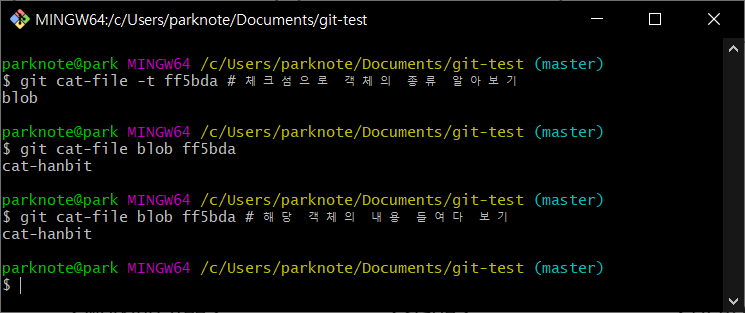


(blob은 binary large object 의 줄임말로 스테이지에 올라간 파일 객체는 blob이 됩니다)


이번 절에서는 git add 명령이 워킹트리에 존재하는 파일을 stage에 추가하는 명령이라는 것을 확인했습니다. 

<span style="color:red;font-weight:bold;">이때 해당 파일의 체크섬과 같은 이름을 가지는 blob 객체가 생성되고,
이 객체는 .git/objects 파일에 저장됩니다</span>.

그리고 <span style="color:red;font-weight:bold;">스테이지의 내용은 .git/index에 기록</span>됩니다. 


## :ocean: git commit 동작 원리


### :fish: 커밋 관찰하기


#### :sushi: 평범한 커밋과 상태 확인

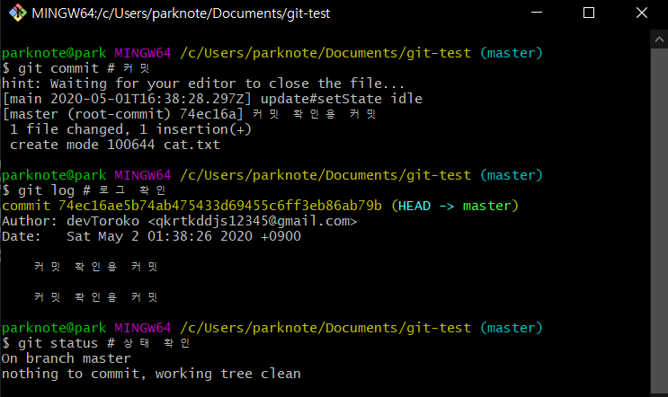


커밋을 하면 어떤 변화가 일어나는지 CLI를 통해서 상태를 확인해봅시다.


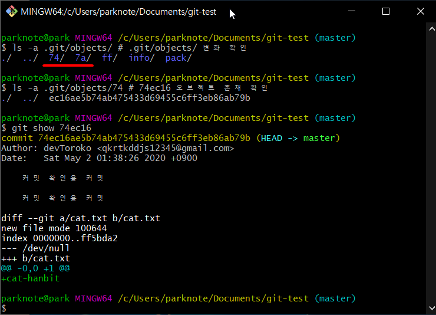


[.git/object] 에는 객체를 저장한다는 것을 이제는 아실 겁니다.

그리고! 방금 전 한 커밋도 객체라는 사실도 객체랍니다.

그래서 위 그림에서 빨간 줄이 쳐진 곳을 보면 해당 커밋 객체의 체크섬 앞자리가 보일 겁니다.


어라... 그런데 "7a" 는 뭘까요?? 이건 조금 있다가 알려드릴게요.


그리고 여기서 중요한 점은 스테이지가 commit을 해도 비지 않는다는 것입니다.

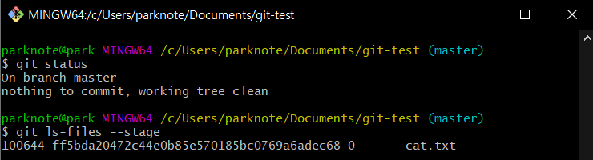


이것은 아래 url을 타고 읽어 봐도 되지만...

https://git-scm.com/book/ko/v2/Git-%EB%8F%84%EA%B5%AC-Reset-%EB%AA%85%ED%99%95%ED%9E%88-%EC%95%8C%EA%B3%A0-%EA%B0%80%EA%B8%B0


일단 짧게 설명하자면 아래 이미지와 같은 상태입니다.

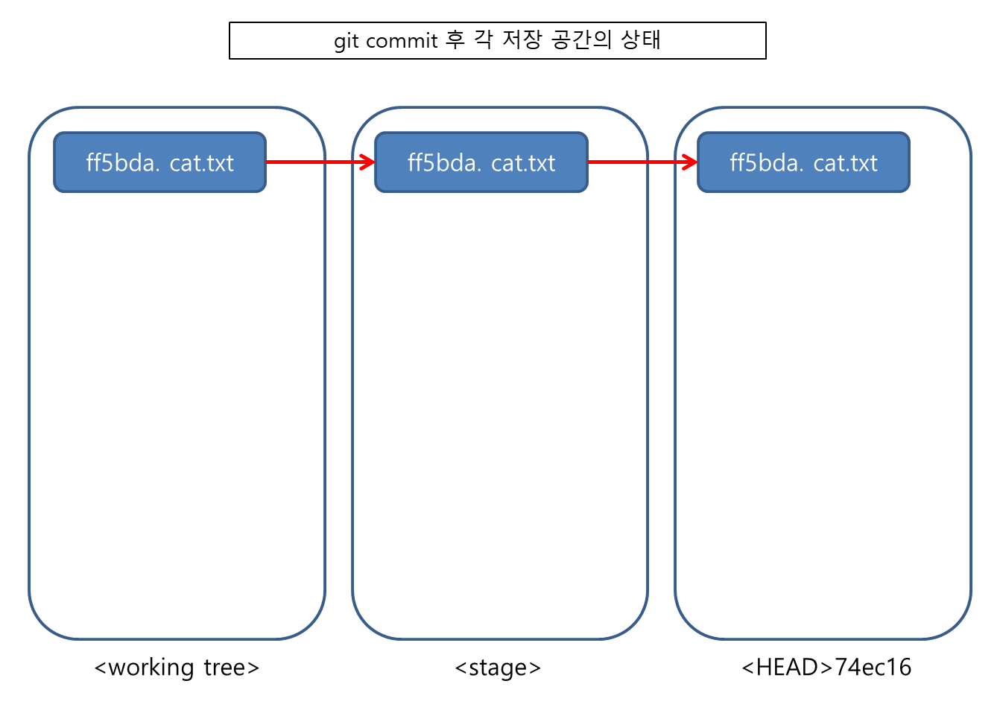

(화살표는 별 의미가 없습니다. 그냥 같은 파일이라는 것을 보여주기 위함입니다)


즉, git status에서 "clean" 하다는 것은  

<span style="color:red;font-weight:bold;">워킹트리 = 스테이지 = HEAD</span> 라는 것을 의미합니다.


### :fish: Git tree 객체


#### :sushi: 수상한 객체 살펴보기

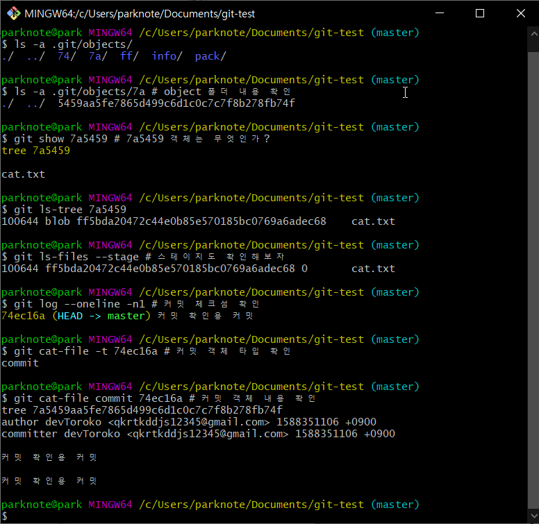


희한하게 여러분과 저의 .git/objects 폴더에는 똑같은 체크섬이 보일 겁니다. 바로 "7a5459" 입니다.
완전히 동일한 객체라는 뜻이죠. 체크섬이 같은 객체는, 같은 내용을 가지게 됩니다.


git show를 통해서 정체를 확인해보니 tree 객체라는 것을 알 수가 있죠.


git ls-tree 명령으로 트리 객체의 내용을 볼 수 있는데, 이 내용은 스테이지와 동일한 것을 확인 할 수 있습니다.


커밋 객체의 체크섬을 이용해 타입을 확인해 보면 commit이 나오고
이 커밋 객체의 내용을 들여다 보면 <span style="color:red;font-weight:bold;">커밋 메시지와 트리 객체로 구성되어 있다</span>는 것을 알 수 있습니다.


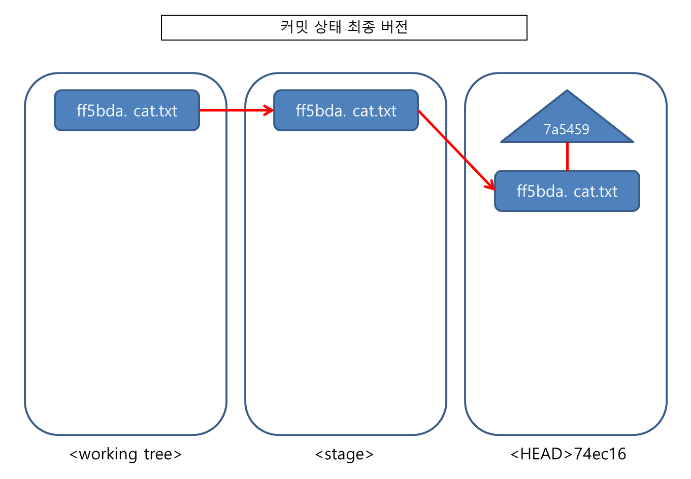


지금까지의 내용을 요약하면...

1. <span style="color:red;font-weight:bold;">커밋을 하면 스테이지의 객체로 트리가 만들어집니다.</span>
2. <span style="color:red;font-weight:bold;">커밋에는 커밋 메시지와 트리 객체가 포함됩니다.</span>


생각보다 Git의 내부 구조가 단순하다는 생각이 들지 않나요?


## :ocean: 수동 커밋하며 살펴보기


### :fish: 파일 수정하고 추가 커밋하기

이번에는 파일의 내용을 수정하고 인덱스에 추가해  보겠습니다.


#### :sushi: 파일 내용 수정 + 체크섬 확인

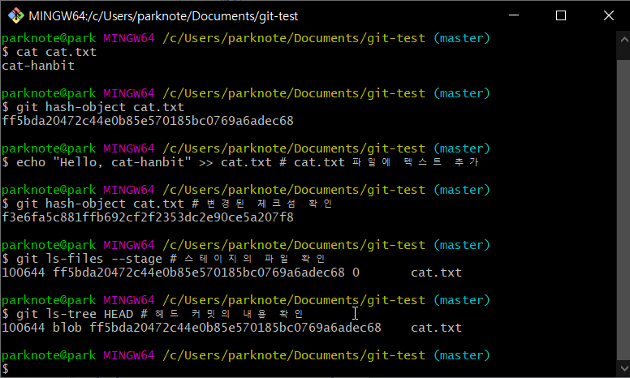


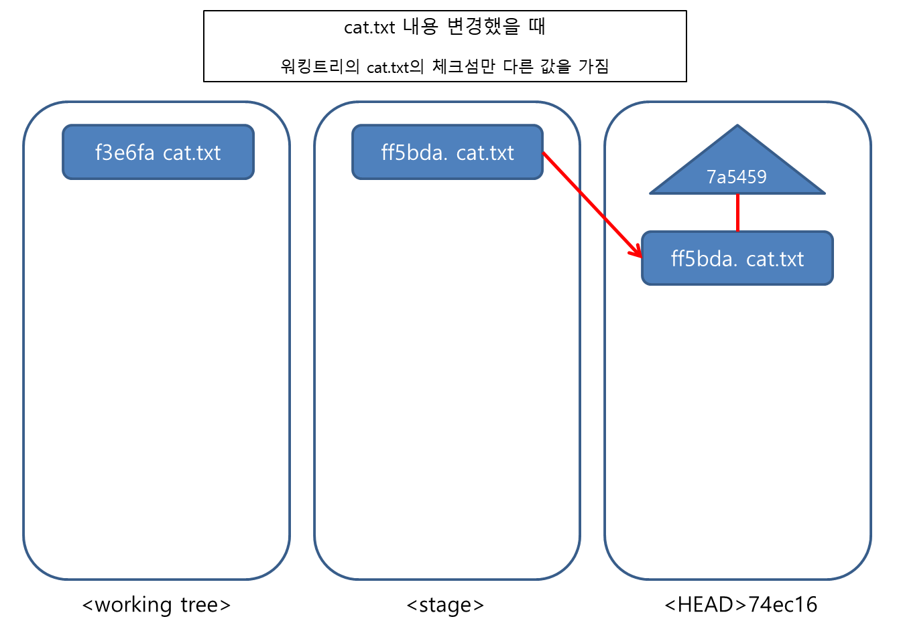


아직 스테이지에 추가하지 않은 상태이기 때문에 Git은 위처럼 구성되어 있을 것입니다.

변경된 파일은 'modified' 라고 했습니다. 
'modified' 는 스테이지와 워킹트리의 내용이 다른 파일을 일컫는 말입니다.


#### :sushi: 변경 내용 스테이지에 추가

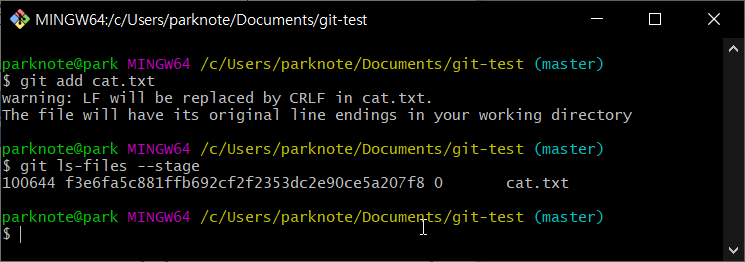


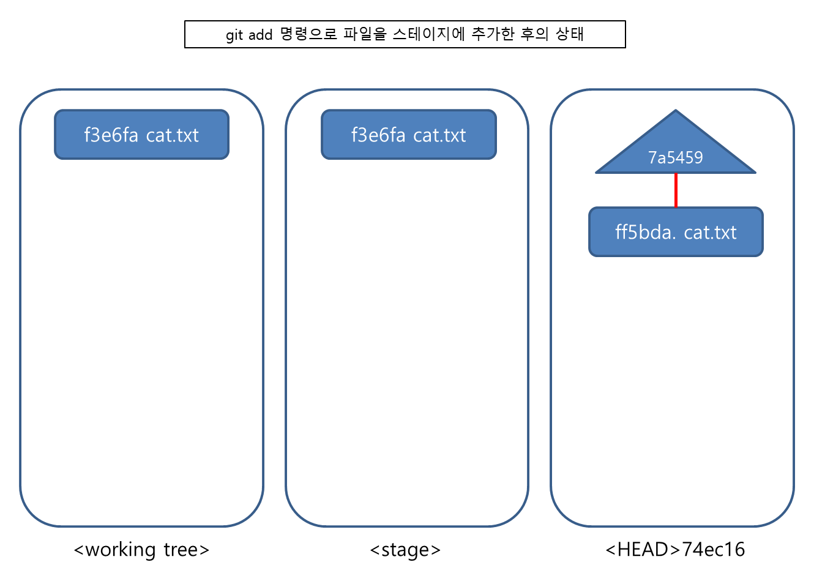


#### :sushi: 수동으로 트리 만들고, 커밋하기


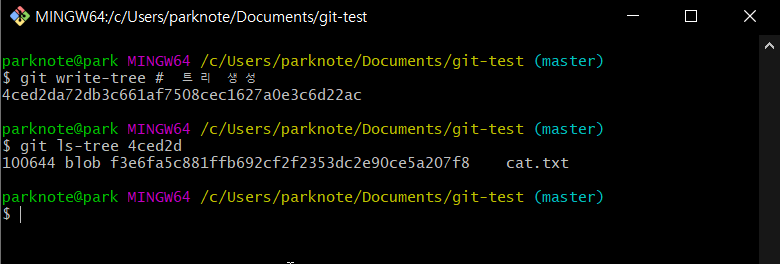


git write-tree 명령은 스테이지의 내용으로 트리 객체를 생성합니다. 그리고 나서 생성된 트리 객체의 체크섬을 
화면에 출력해 줍니다

생성된 트리 객체를 확인해 보면 스테이지의 내용과 같다는 것을 확인 할 수 있습니다.


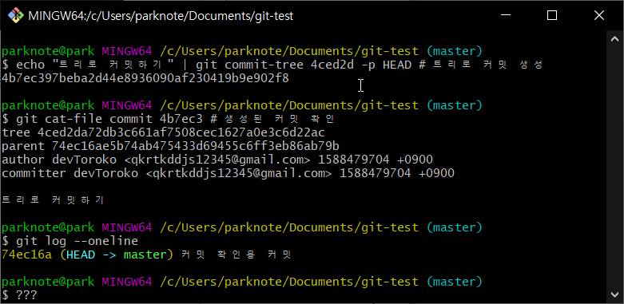

위 그림은 우리가 수동으로 만든 트리를 통해서 커밋을 생성하는 것입니다.

git cat-file commit 4b7ec3 를 통해서 내용을 확인해보니 커밋이 확실합니다.

그런데 이상하네요, git log 를 했을 때 해당 커밋이 보이지가 않네요!


git log에 우리가 만든 커밋이 안나오는 이유는 <span style="color:red;font-weight:bold">HEAD 가 갱신되지 않았기 때문</span>입니다. 직접 갱신해보겠습니다.


#### :sushi: HEAD 갱신하기

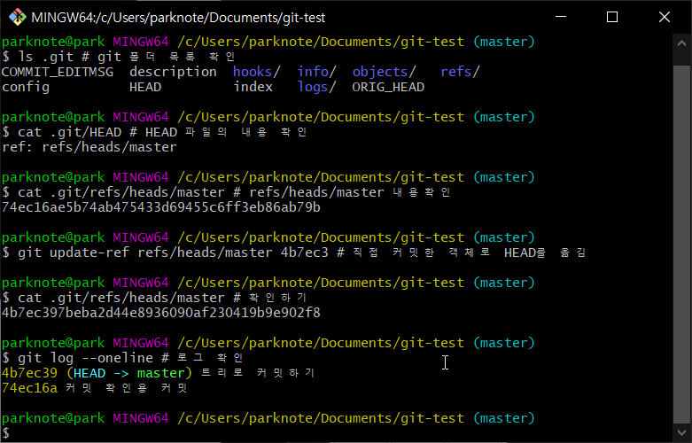


ls .git을 통해서 HEAD 파일을 확인하고, 해당 파일의 내용을 확인해보니  `ref: refs/heads/master` 라고 씌여있습니다. 그렇다면 `refs/heads/master` 의 내용도 확인해봐야겠죠? 

내용을 보니, 예전 커밋 체크섬(74ec16)이 씌여있네요. 그러면 갱신을 해서 저희가 만든 커밋의 체크섬으로 내용을 갱신해줍니다.

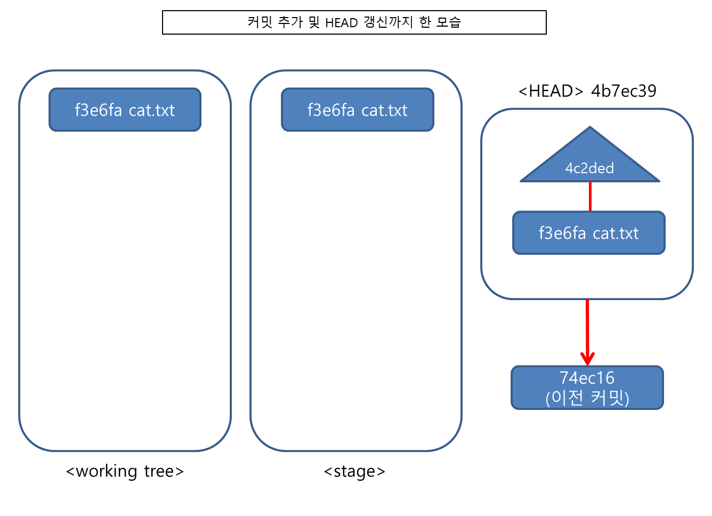


### :fish: 중복 파일 관리 (blob)


git 에는 `blob` 이라는 타입이 존재합니다. 이  타입은 제목이나 생성 날짜에 관계 없이 

<span style="color:red;font-weight:bold;">내용이 같을 경우 같은 체크섬을 가집니다</span>.


#### :sushi:  같은 내용의 파일 커밋하기


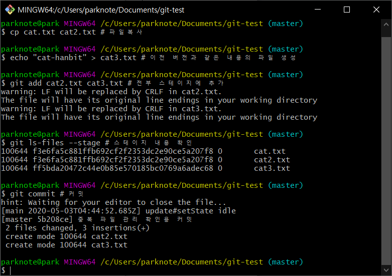


우리가 새로운 커밋을 여러 개 만들거나 같은 파일을 다른 폴더 등에 복사해서 여러 개 만들어도 그 안의 내용이 같다면,  하나의 blob 으로 관리되므로 사용자들은 여기에 대해서 크게 신경쓸 필요가 없습니다.

덕분에 git이 빠르고 가벼워진 것이죠.


## :ocean: 정리


| 명령어     | 내용                                                         |
| ---------- | ------------------------------------------------------------ |
| git add    | 워킹트리의 내용을 스테이지에 반영합니다.                     |
| git commit | 스테이지의 내용을 가지고 트리 객체를 만들고<br />이 트리 객체를 기반으로 기존 HEAD 커밋을 부모로 하는 새로운 커밋을 만듭니다.<br />마지막으로 생성된 커밋은 다시 HEAD가 됩니다. |


