<div style="text-align:center">
<span style=";font-weight:bold;font-size:2em">팀 개발을 위한 Git,GitHub 시작하기</span>
</div>


# :anchor: Chp09 - 인증 기능 살펴보기

<br>

<br>

<br>

##  :trident: TODO

| 구분 | 내용                                  |
| ---- | ------------------------------------- |
| 1절  | 자격 증명 관리자(윈도우, 맥, 리눅스)  |
| 2절  | SSH 프로토콜(SSH 키 생성, 등록, 클론) |

<br>

GitHub의 공개 프로젝트에 참여하기 위해 개인용 계정을 새로 만들어 사용하다보면 종종 문제가 발생합니다.

이런 문제를 해결하기 위해서는 git의 인증 기능에 대해서 알아야 합니다. 

마지막 장이니까 힘내세요!

<br>

<br>

<br>

<br>

## :ocean: 인증 관련 기능 사용하기

<br><br>


### :fish: 윈도우의 자격 증명(Credential) 관리

일단 앞에서 작업한  hello-git-cli 프로젝트를 열고 Git Bash를 실행한 후 옵션 값을 살펴보겠습니다.

<br>


 credential.helper 옵션 값이 manager이고 시스템 옵션으로 설정한 값이라는 것을 CLI를 통해서 알아냈습니다.

manager 외에도 cache 또는 store 값도 올 수 있는데, 윈도우에서는 manager를 사용하는 것이 일반적입니다.

manager로 설정되어 있을 경우 git은 윈도우 운영체제에서 제공하는 자격 증명 관리자에 사용자 인증 관련 정보를 저장합니다.

<br>

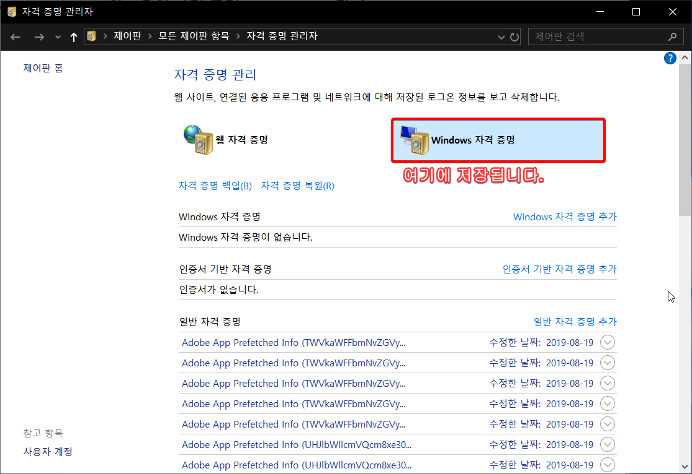


윈도우의 `자격 증명 관리자` 는 그다지 사용하기 편리한 프로그램은 아닌데, 다행히도 소스트리가 자격 증명 관리자를 더 쉽게 사용할 수 있게 도와줍니다.


가볍게 실습을 하나 하겠습니다. 

실습의 내용은 기존의 자격 증명을 제거해서 로그인 창을 띄우는 것입니다.


자격 증명을 제거하는 방법은 크게 2가지입니다.


1. 소스트리의 [ 도구 - 옵션 - 인증 ] 에서 사용자 계정 정보 V 모양 버튼을 누른 후 삭제를 누르기
2. 윈도우의 자격 증명 관리자에서 해당 계정의 V 버튼을 누른 후 [ 제거 ] 버튼을 누르기


이번 실습은 2번을 통해서 하겠습니다.


저는 실습에서 사용했던 devToroko 및 다른 git 계정들을 삭제할 예정입니다.

일반 자격 증명 중에 git: 으로 시작하는 자격 증명들을 꼼꼼하게 삭제합니다.


---


계정 정보를 이제 등록해야 하는데, 이것 또한 방법은 2가지입니다.

1. 소스트리에서 직접 입력하는 방법
2. CLI 에서 git push 명령을 사용하는 방법

<br>

2번 방법으로 해보죠. <br>

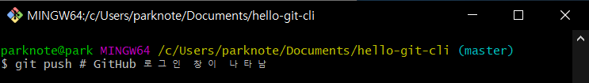

<br>

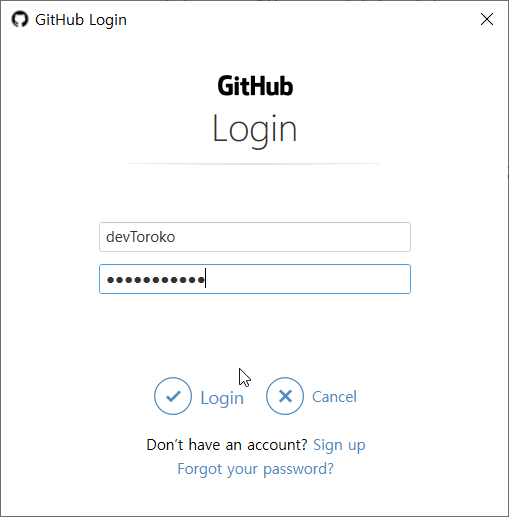

<br>

로그인 정보를 입력한 후 자격 증명 관리자를 보면 아래와 같습니다. 

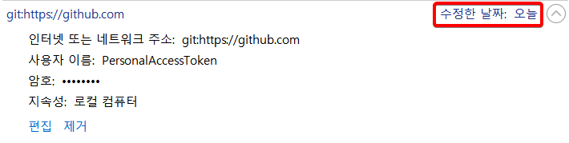


<br><br>


<br>

## :ocean: SSH 키 생성 및 사용하기

<br><br><br>

### :fish: SSH란?

SSH ( Secure SHell )  프로토콜은 1995년에 개발되었으며, unix 나 linux 같은 OS 에 안전하게 접속하기 위해 만들어졌습니다. 최근에는 클라우드 등 리눅스 서버에 접속하기 위해서 주로 많이 사용됩니다.

윈도우에서 사용하는 putty나 secure CRT 라는 프로그램들이 SSH를 사용합니다.


<br><br>


### :fish: SSH 키 생성하기

이전까지 사용하던 https 방식은 사용자 아이디와 패스워드를 이용해서 사용자 인증을 했습니다.

SSH를 이용하면 조금 다른방식으로 인증을 하게 되는데, `공개키 / 비밀키` 방식을 사용합니다.

<br>

간략하게 설명하자면 , 공개키는 자물쇠이고, 비밀키는 열쇠입니다.

<br>

내 컴퓨터에 열쇠를 저장하고 GitHub에 자물쇠를 업로드하면 열쇠와 자물쇠의 쌍을 이용해서 사용자 인증을 합니다. 당연한 얘기지만 비밀키는 타인 또는 다른 서비스 등에 노출되면 안 됩니다.

<br>

SSH 를 사용하기 위한 첫 단계로 먼저 SSH 키를 생성합니다. 

Git Bash 에서 SSH-keygen 명령을 이용해서 만들어 보겠습니다.

<br>

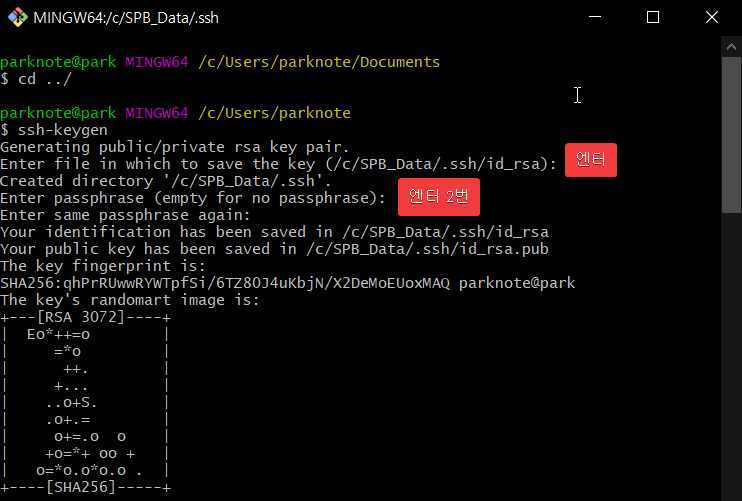

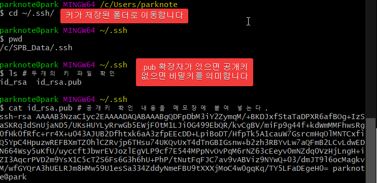

맨 밑에 나오는 공개키가 나오는데, 이것을 메모장에 복붙합니다.  

  


<br>

  


### :fish: GitHub 에 키 등록하기

이제 우리가 생성한 키를 GitHub에 등록해야 사용할 수 있습니다. 

당연한 얘기지만 자물쇠인 공개키를 등록해야합니다.

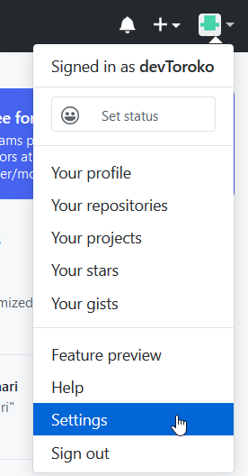


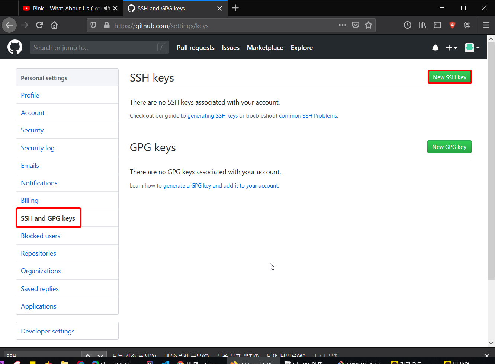


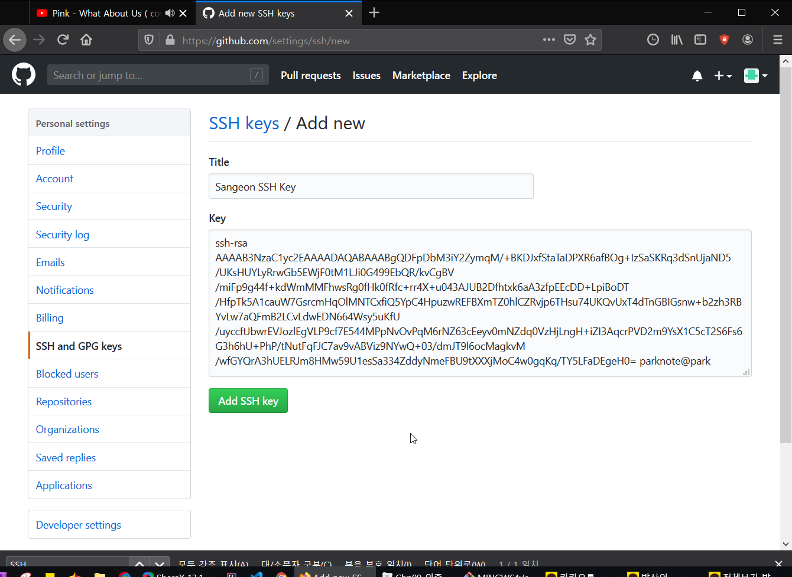


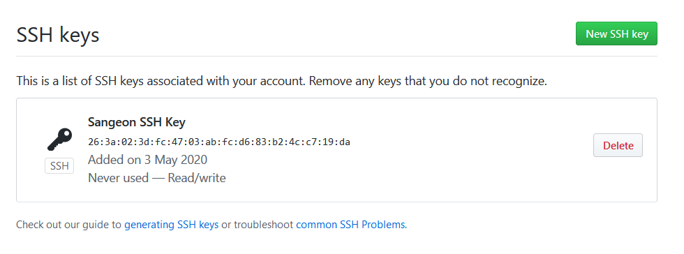

  

  

  


### :fish: SSH를 이용해서 저장소 클론하기


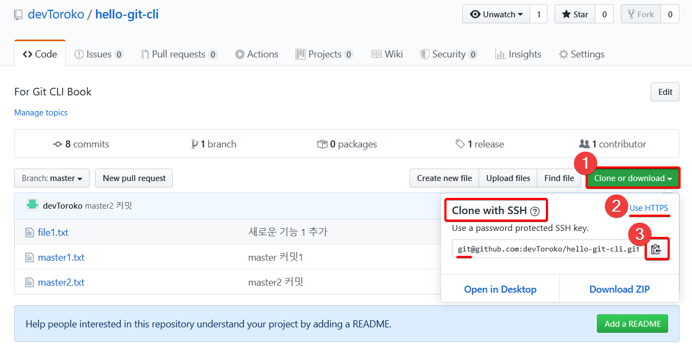

원격 저장소에서 주소를 얻어 올건데, 이번에는 SSH로 복사해올 겁니다.

SSH를 사용한 원격저장소 주소는 첫 부분이 **git@**로 시작하는 것을 확인 할 수 있습니다.


적당한 폴더로 옮겨서 git Bash를 실행하고 clone을 해보겠습니다. 저는 배경화면에서 하겠습니다.

  

  


#### :sushi: SSH로 원격저장소 클론하기 1

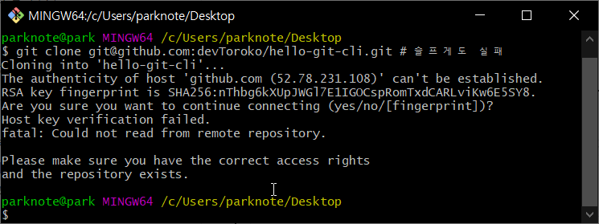

실패네요 (주륵) .

이건 아직 마지막 단계를 하지 않아서 그런 겁니다.

  

  


#### :sushi: SSH 설정 파일 생성 및 내용 확인

  


```spreadsheet
$ echo "Host github.com" >> ~/.ssh/config
```

  

해당 파일로 가서 VS Code 로 아래와 같이 수정합니다.

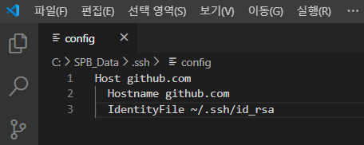

아래 2~3번째 줄은 앞에  **공백 2칸**이 들어가니 주의하세요!

  

  

이제 다시 클론해봅시다


#### :sushi: SSH로 원격저장소 클론하기 2

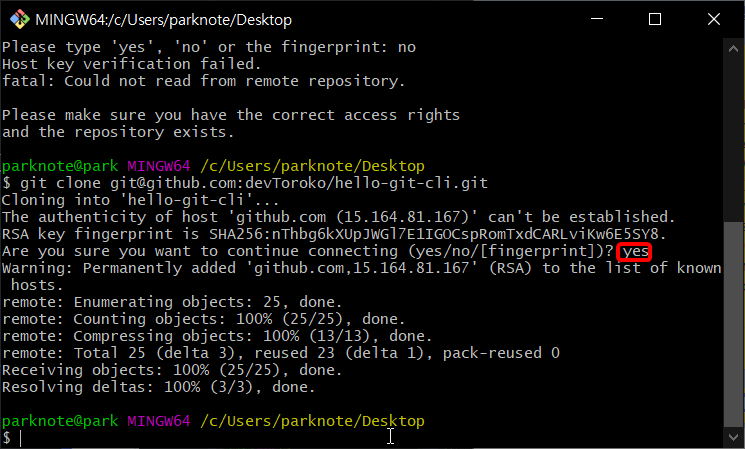

질문을 한 번 하는데, 꼭 yes라고 답해주세요.  

  


그런데, 만~약에 비밀키가 외부에 노출되면 어떻게 할까요? 그냥 GitHub에 등록된 공개키를 제거하고 새로운 공개키와 비밀키를 만들어서 다시 등록하면 됩니다.   

  

집 열쇠를 잃어버리면 현관 자물쇠를 바꾸는 것과 같은 이치입니다.  

  

  

